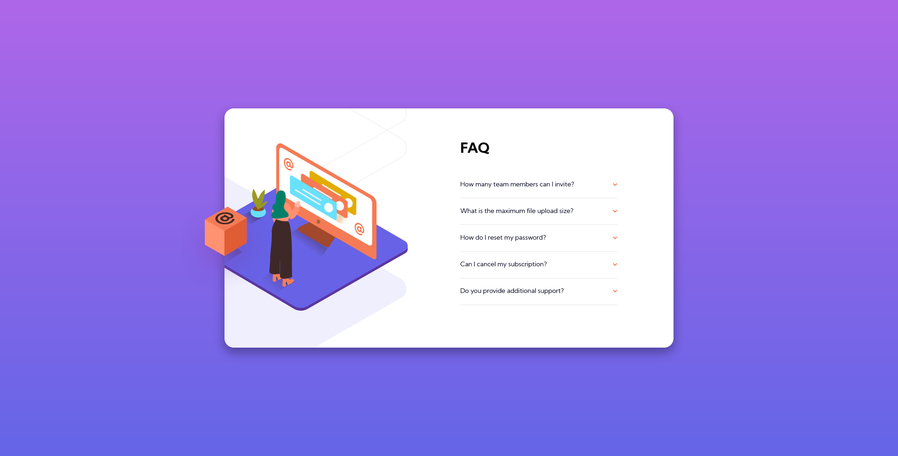

# Frontend Mentor - FAQ accordion card solution

This is a solution to the [FAQ accordion card challenge on Frontend Mentor](https://www.frontendmentor.io/challenges/faq-accordion-card-XlyjD0Oam). Frontend Mentor challenges help you improve your coding skills by building realistic projects.

## Table of contents

- [Overview](#overview)
  - [The challenge](#the-challenge)
  - [Screenshot](#screenshot)
  - [Links](#links)
- [My process](#my-process)
  - [Built with](#built-with)
  - [What I learned](#what-i-learned)
  - [Continued development](#continued-development)
  - [Useful resources](#useful-resources)
- [Author](#author)

## Overview

### The challenge

Users should be able to:

- View the optimal layout for the component depending on their device's screen size
- See hover states for all interactive elements on the page
- Hide/Show the answer to a question when the question is clicked

### Screenshot



### Links

- Solution URL: [Add solution URL here](https://github.com/WidePeepoHappy/faq-card.git)
- Live Site URL: [Add live site URL here](https://widepeepohappy.github.io/faq-card/)

## My process

### Built with

- Semantic HTML5 markup
- Flexbox
- SASS
- Mobile-first workflow

### What I learned

Used rem more in general and became more comfortable with position absolute.

```css
.card-box-container {
  position: relative;
  @media (min-width: 60rem) {
    height: 32rem;
  }
  .box {
    display: none;
    @media (min-width: 60rem) {
      display: block;
      position: absolute;
      z-index: 100;
      left: -5.8rem;
      top: 13rem;
    }
  }
}
```

### Continued development

Need to work more on positioning elements.

### Useful resources

- [MDN Background article](https://developer.mozilla.org/en-US/docs/Web/CSS/background) - Helped with positioning background image.

## Author

- Frontend Mentor - [@WidePeepoHappy](https://www.frontendmentor.io/profile/WidePeepoHappy)
